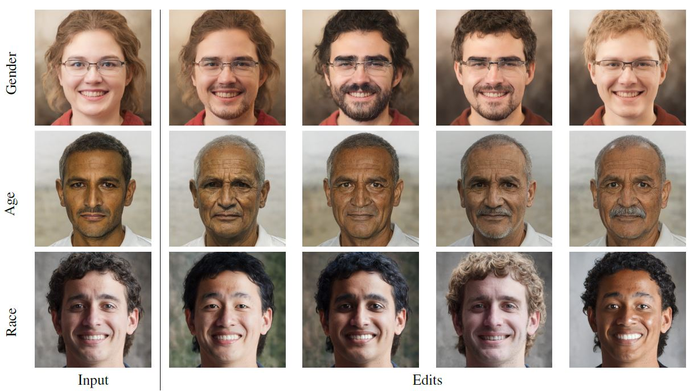

# Multi-Directional Subspace Editing in Style-Space



This repository contains the code implementation for the following paper:

> Multi-Directional Subspace Editing in Style-Space.<br>
> Chen Naveh, Yacov Hel-Or<br>
> arXiv. https://doi.org/10.48550/arXiv.2211.11825

[[Paper](https://arxiv.org/pdf/2211.11825.pdf)]
[[Project Page](https://chennaveh.github.io/<MDSE>/)]

## Requirements
```
conda env create -f environment.yaml
conda activate mdse
```

## Pre-trained Model
Download and extract model weights from [here](https://drive.google.com/drive/folders/1K3E4TgpKsjY6Nr7c1awBo9Rc1nRts7pZ) to checkpoints directory.

## Reconsruct Figure from Paper
```
python main.py
```

## Citation
If you use our code or model useful in your research, please cite this paper: 
```
@article{naveh2023multidirectional,
      title={Multi-Directional Subspace Editing in Style-Space}, 
      author={Chen Naveh and Yacov Hel-Or},
      year={2023},
      eprint={2211.11825},
      archivePrefix={arXiv},
      primaryClass={cs.CV}
}
```

## Acknowledgements
This repository uses stylegan implementation from [genforce/sefa](https://github.com/genforce/sefa).